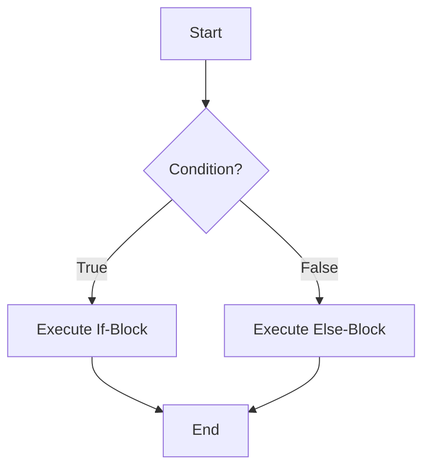
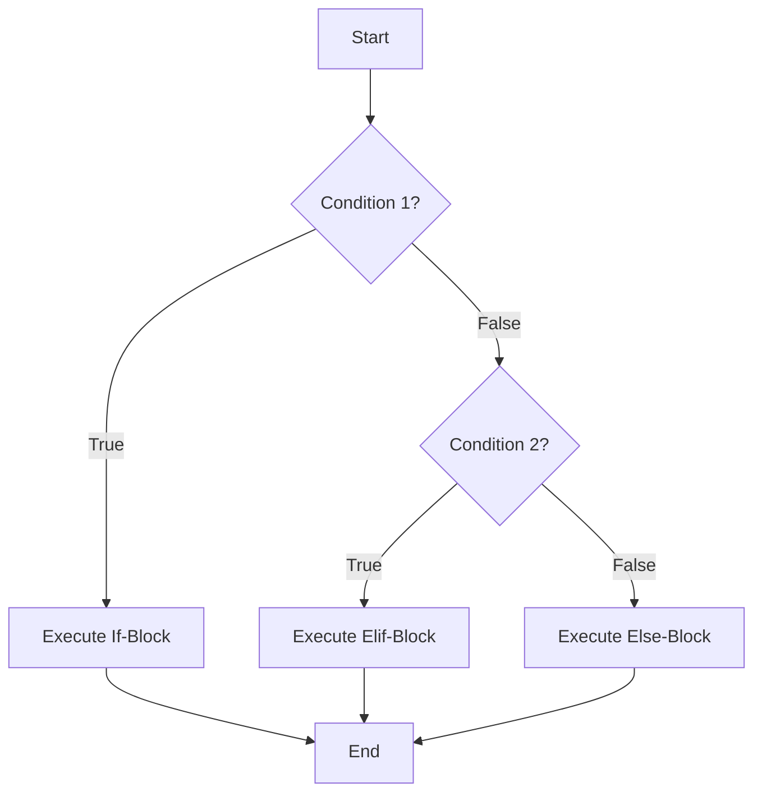
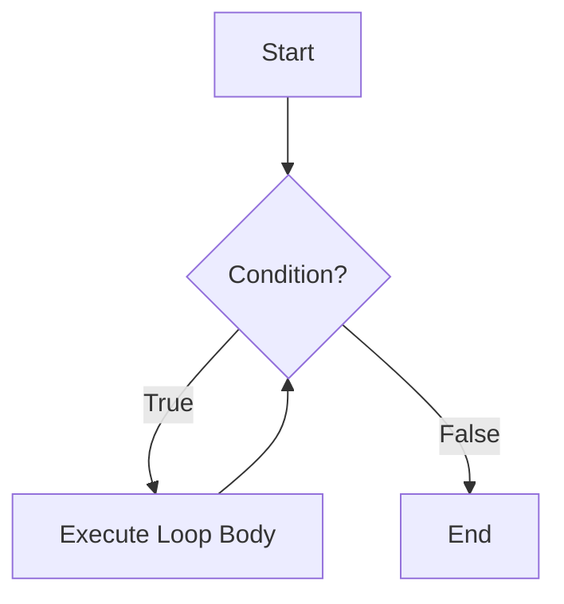

# Ohjelmisto 1 kurssin koodiesimerkit

Opettajien github-tunnukset: UllaSe ja mattpe

## `if-else` vs. `while` control flow

If:



If & else-if (elif):



While:



## Tips

Vinkkejä mahdollisiin ongelmatilanteisiin GitHubin kanssa.

Jos virheilmoitus valittaa, että tunnus/käyttäjänimi puuttuu, aseta ne terminaalissa:

```sh
git config --global user.email "sinun.maili@osoitteesi.fi"
git config --global user.name "Sinun Nimesi"
```

Sähköpostiosoitteen pitää olla sama, mitä käytit GitHubiin rekisteröityessäsi.

Repon luominen Githubissa onnistuu, mutta ei oikeuksia/push ei onnistu: 

- Tarkista terminaalissa komennolla `git remote -v`:
  - origin osoitteen pitää alkaa `https://...`
  - osoitteen pitää loppua `repon-nimi.git`, jossa `repon-nimi` sama kuin projektin nimi githubissa

